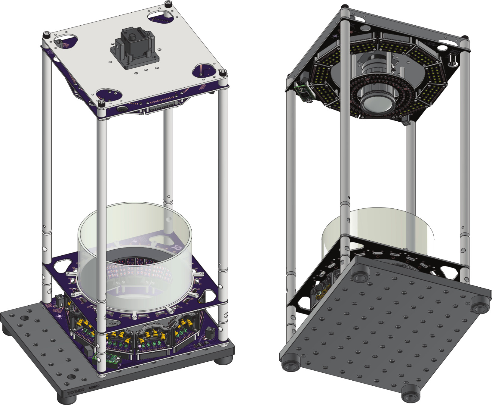

### A. Corver, A. Gordus (2023) A hardware assay for tracking dynamic spider web geometry

This repository contains design files for a hardware array enabling tracking of spider's leg movements and dynamic web geometry using high-angle scattering NIR illumination.

##### Overview

